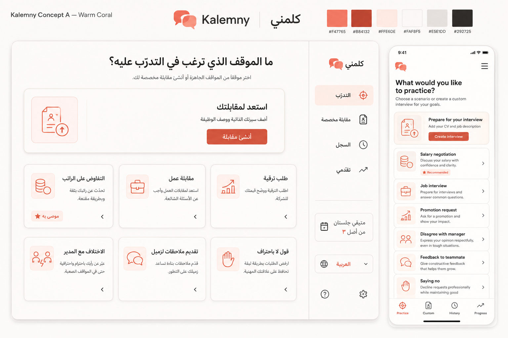
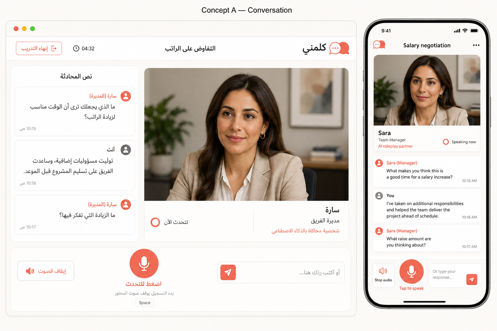
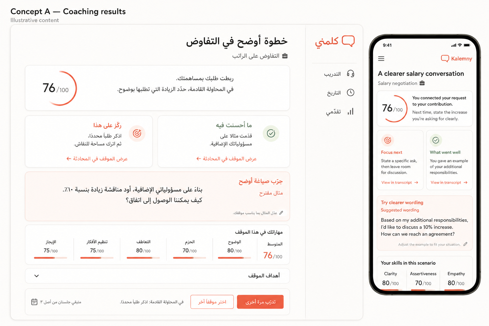

# Kalemny / كلمني — Warm Coral

September 6, 2026. User-selected Concept A. Approved direction; implementation remains pending. This replaces the prior Calm Coaching/neo-brutalist direction. Tasks: [REDESIGN_PLAN.md](REDESIGN_PLAN.md). Technical boundaries: [REDESIGN_TECHNICAL_DECISIONS.md](REDESIGN_TECHNICAL_DECISIONS.md).

## Identity and candidate tokens

Workplace communication is the primary purpose; interviews are one feature. Light mode only, warm off-white, white cards, coral accents, charcoal text, moderate rounding and subtle depth. Remove neo-brutalism, heavy black outlines, offset shadows and blue/purple gradients. Huru and Yoodli inform spaciousness and organization, not feature scope.

Brand name: Kalemny / كلمني. Concept A's dialogue mark is a draft, not final production lettering. M01 refines an original vector mark, bilingual lockups and small favicon.

| Semantic role | Candidate |
| --- | --- |
| Background | `#FAF8F5` |
| Surface | `#FFFFFF` |
| Text | `#292725` |
| Secondary text | `#625B57` |
| Brand coral | `#F47765` |
| Action/link | `#B84132` (white text on solid action) |
| Selected surface | `#FFF0EB` |
| Decorative divider | `#E5E1DD` |

Finalize and measure combinations in M01. A light decorative divider is not an adequate sole input boundary; define stronger control/focus tokens. Errors need distinct semantic treatment and text, not coral alone. Use semantic tokens; no per-screen raw colors or decorative gradients. Generated shading is not a requirement.

Typography: coordinated humanistic sans families with native Arabic coverage; choose exact licensed family/loading approach in M01. Start with 16px body, locale-appropriate comfortable line height, medium/semibold headings, 4/8px spacing rhythm, 16px mobile gutters and roughly 14–16px card rounding. Do not letter-space Arabic or force English text metrics onto it.

## Arabic and English

- Entire landing/auth/selection/setup/custom/simulation/results/history/progress experience and utility states translated. Broad Arabic-speaking audience, friendly Modern Standard Arabic interface; Egyptian/Gulf conversation dialect separately selected.
- RTL document and layout, desktop sidebar right, logical start/end spacing and appropriate directional icon mirroring. Never mirror portraits or nondirectional symbols.
- Localize accessible names, errors, plurals, counts and dates. Preserve mixed-direction URLs, English names and transcripts. Do not rewrite stored text on interface language switch.
- Interface locale and immutable attempt language are separate. Preference persistence and generated-feedback language policy are explicit M01/M03 decisions, not inferred from a UI mockup.

## Practice selection and navigation

After sign-in `/app` is practice selection; preserve intended protected return URLs and existing deep links. Primary destinations: Practice / التدرّب, Custom interview / مقابلة مخصصة, History / السجل, Progress / تقدّمي. Language/account controls remain accessible on desktop and mobile. Remove global sidebar during simulation.

Heading: “What would you like to practice?” / “ما الموقف الذي ترغب في التدرّب عليه؟”.

- Show all six curated scenarios directly in a grid or normal scrolling mobile list. No carousel/collapsed section/mandatory category click for discovery.
- Cards show title, concise situation/skill description and setup affordance. Selecting a card opens setup, never starts automatically.
- Recommendation is a small badge with reason on an equal-size ordinary card, never a dominant banner or preselection.
- Compact custom panel near the top: “استعد لمقابلتك”, “أضف سيرتك الذاتية ووصف الوظيفة”, “أنشئ مقابلة”. Persistent custom navigation provides another entry. Shorten the generated board's custom panel to preserve balance.
- All paths must be discoverable, not fit in one phone viewport. Difficulty/language/mode settings follow scenario selection.
- During testing, all types free with three combined starts per rolling seven days; show server-authoritative remaining usage, no upgrades. Generation/review is distinct from a counted simulation start.

## Landing, auth and briefing

Landing leads with workplace situations, practice/coaching/retry benefits, truthful previews and a clear start CTA. Interview preparation stays visible alongside other scenarios. Replace paid testing-era promotions with accurate free-testing/limit copy; no invented testimonials or outcome promises.

Preserve Clerk security and return paths. Setup presents public context/roles/objective, difficulty, conversation language/dialect, supported mode and usage before start. Custom workflow explains CV/JD and in-memory CV handling; supports validation, generation/review errors and retained drafts. Hidden rubrics never appear.

## Simulation workspace

Desktop: compact scenario/timer/finish header, portrait stage beside continuously visible transcript, comfortable controls below. Fixed realistic fictional adult counterpart per curated scenario; suitable default custom interviewer. Match public name/role/voice, label AI roleplay partner. Static portrait plus subtle state indicator; no camera, learner video, lip-sync or per-session image generation. Portrait failure falls back to initials/name.

Transcript follows messages only while learner is at the newest content. Manual readback never jumps; offer return to latest. Render actual turn ownership/status and persisted transcript on reload. Timer reflects real attempt, not a fictional fixed question sequence.

### Mobile correction — overrides generated board

1. Compact portrait/name/status, leaving useful visible transcript space beneath.
2. Full-width composer on a dedicated row, accessible send action inside.
3. Separate spacious mic row; tap to record, then Done and smaller Cancel. Preserve review-before-send/auto-send option.
4. Stop playback beside speaking status, not squeezed between mic and composer.
5. Reserve controls and bottom safe area; keyboard-open layout keeps composer and some transcript visible, shrinking/collapsing portrait as needed.
6. Verify 360/390px, landscape, zoom and long Arabic labels. Never use hidden overflow as a layout fix.

### State behavior

| State | Required behavior |
| --- | --- |
| Ready | Clear turn status, mic and typing available. |
| Recording | Visible active capture, Done/Cancel, 120-second limit. |
| Transcribing | Explain wait, retain draft, recovery/text fallback. |
| Review | Editable transcript, send, existing review preference. |
| Reply pending | Accepted text visible, preparing reply state, typing allowed while submission respects one pending turn. |
| Speaking | PTT available; capture stops/aborts audio including delayed playback; stop action visible. |
| Mic/TTS error | Specific recovery, always text fallback. |
| Finish/expiry | Stop capture/playback, accessible confirmation/recovery, preserve frozen transcript/lifecycle. |

Desktop hold-Space respects editable focus, dialogs and IME; preserve Enter/Shift+Enter behavior. Touch does not require holding. Continuous-call mode has distinct listening/mute semantics; PTT must not imply always-open microphone. Respect reduced motion; announce concise status, not repeated entire transcripts.

## Results and continued practice

Results order: brief supportive honest summary with modest authoritative score; strengths/improvements linked to stored moments; clearly labeled suggested wording; five skills/objectives; one next focus and retry, with comparison when available.

Stack coaching cards on mobile. Evidence resolves actual stored turn IDs, never AI-reconstructed quotes. Stronger wording cannot invent achievements, authority or numbers. Keep short-session eligibility understandable. Scores remain practice scores, never employment judgments. Retry is a new counted attempt.

History shows scenario/difficulty/language/date/status, results/comparison links, owner-only deletion and empty/error states. Progress retains latest-five eligible computation, readable numbers/accessible charts and restrained recommendations returning to the full library. Deleting history never restores quota.

## Accessibility and validation

44px minimum interactive targets with separation; visible focus; 4.5:1 normal text and 3:1 large text/meaningful control graphics; no color-only state. Proper labels, heading order, dialog focus/restore, accessible auth, localized live regions. Test reduced motion, zoom, keyboard/screen reader, loading versus empty, mic denial, late audio, quota exhaustion, both locales and long content. Record exact contrast/device evidence rather than inferring it from images.

## Concept boards and known corrections

Built-in image generation produced these planning references. Prompt briefs: warm-coral bilingual practice page with six scenarios and CV/JD custom entry; bilingual call workspace with fictional portrait and visible transcript; supportive evidence-linked coaching. The written requirements above govern implementation.

These are not production assets or pixel-exact specifications. Normalize inconsistent generated logos, Arabic labels, card ordering, English mobile coaching order, shading and small text. Portrait proportions and mobile footer require correction. Scores/names/times and numeric suggestions are illustrative, not valid fixtures or authority for inventing learner facts. Final logo/font/token review and all responsive/accessibility verification remain M01 onward.
